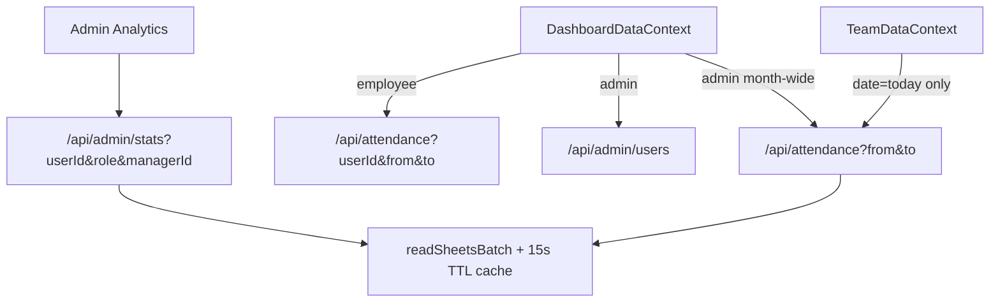

# Digital Technologies — Leave & Attendance Dashboard

A modern Leave and Attendance Management Dashboard built with **React (Vite)** + **Vercel Serverless Functions** + **Google Sheets** as the database.

---

## Quick Start (Local Development)

```bash
git clone <repo-url> digital-technologies-attendance
cd digital-technologies-attendance
npm install
cp .env.example .env
# Set GOOGLE_SERVICE_ACCOUNT_JSON and GOOGLE_SPREADSHEET_ID
npm run dev
```

Opens at `http://localhost:3000` (Vite + `/api` via Vercel dev on port 4000).

| Script | Purpose |
|--------|---------|
| `npm run dev` | Local development |
| `npm run build` | Production build (used by Vercel deploy) |

### Sheet tabs (header row required)

| Tab | Columns |
|-----|---------|
| Users | UserID, Name, Email, Password, Role, ManagerID, **LeavePool (G)**, **LeaveApprovedDays (H)**, **LeavePendingDays (I)**, **SundayHolidayPresent (J)**, **CanMarkAttendance (K)** |
| Holidays | Date, HolidayName |
| Leaves | LeaveID, UserID, FromDate, ToDate, Status, Reason |
| Attendance | AttendanceID, UserID, Date, Status, MarkedBy, Reason |
| WeekendWork | *(deprecated — optional legacy tab; weekend presence uses Attendance)* |

### Users sheet stat columns (event-driven)

| Col | Field | Index | Updated when |
|-----|-------|-------|--------------|
| **G** | LeavePool | 6 | **Static** baseline (22 at Apr–Mar cycle reset). **Not** incremented on Sunday/holiday present. |
| **H** | LeaveApprovedDays | 7 | +days when leave **Approved** (from Pending) |
| **I** | LeavePendingDays | 8 | +days on new **Pending** request; −days on approve/reject |
| **J** | SundayHolidayPresent | 9 | +1 when marked **Present** on Sunday or company holiday |
| **K** | CanMarkAttendance | 10 | Admin toggle (was column H) |

Logic lives in `api/_lib/userSheetStats.js` (`adjustUserStats`, `resetCycleForAllUsers`).

**Employee UI formulas** (from sheet counters, not recomputed from Leaves tab):

| UI label | Formula |
|----------|---------|
| Leave pool | **G + J** (base + Sunday/holiday bonus) |
| Leave used | **H** |
| Pending (Xd) | **I** (days); request count from Leaves tab list |
| Remaining | **`max(0, (G + J) − H)`** |

**Example:** G=22, H=7, I=0, J=1 → pool **23**, used **7**, remaining **16**.

**Apr–Mar cycle reset** (start of each cycle): G→22, H/I/J→0 for all non-admin employees. Run manually:

```bash
node scripts/reset-cycle.mjs
```

Or use **Admin → Access → Reset Apr–Mar cycle** (`POST /api/admin/reset-cycle`). Resolve pending leaves before reset if needed; the Leaves tab is unchanged — only Users counters reset.

---

## Data flow (after optimization)



1. **Dashboard load** — `DashboardDataContext` fetches holidays, user-scoped leaves, and month-scoped attendance in three calls (not full-tab dumps twice). **Admin** calendar loads org-wide `GET /api/attendance?from&to` (no `userId`) plus `GET /api/admin/users` for employee names; opening the Calendar route refetches with `fresh=1` so Team Attendance marks appear without changing month.
2. **Team panel** — `TeamDataContext` uses `GET /api/attendance?date=YYYY-MM-DD` for today only.
3. **Admin stats** — one `batchGet` for Users + Attendance + Leaves; filters applied in Node.
4. **Writes** — `appendRow` / `updateCell` invalidate the tab cache immediately; optional `?fresh=1` on GET forces a live read.

---

## API reference

### Cache & freshness

All GET handlers accept `?fresh=1` (or `fresh=true`) to bypass the 15-second in-memory tab cache. Use after admin **Refresh** or when verifying manual sheet edits.

| Endpoint | Query params |
|----------|----------------|
| `GET /api/attendance` | `date`, `userId`, `from`, `to`, `fresh` |
| `GET /api/leaves` | `userId`, `fresh` |
| `GET /api/leaves/summary` | `userId`, `fresh` — employee leave balance & recent requests |
| `GET /api/holidays` | `fresh` |
| `GET /api/admin/users` | `fresh` |
| `GET /api/admin/stats` | `userId`, `role`, `managerId`, `from`, `to`, `fresh` |
| `POST /api/admin/reset-cycle` | Body: optional `pool` (default **22**) — resets G/H/I/J for all non-admin users |
| `GET /api/subordinates` | `userId`, `fresh` |
| `GET /api/users/profile` | `userId`, `fresh` — refresh session fields from Users sheet |
| `PATCH /api/password` | Body: `email`, `currentPassword`, `newPassword` — updates Users sheet column **Password** |

### Login & password

- **Sign in** — `POST /api/login` with email + password (Users sheet).
- **Update password** — on the login page, **Update password** opens a form; `PATCH /api/password` verifies the current password, then writes the new value to column **D** (min 6 characters, must differ from current).

### Admin stats (`GET /api/admin/stats`)

- **Org view** (no `userId`): `totalUsers` (non-admin employees only; Admin role excluded), `periodAttendance`, `pendingLeaves`
- **Employee view** (`userId` set): adds `selectedEmployee` and `employeeStats`:
  - `presentDays`, `approvedLeaveDays` (col **H**), `leavePendingDays` (col **I**), `pendingLeaves` (request count), `leavePool` (G+J), `baseLeavePool`, `leavePoolRemaining`, `sundayHolidayPresentDays` (col **J**), `sundayHolidayPresentLog`, `attendanceRate`, `statsPeriod`, `attendanceRateMeta`
  - `attendanceRate` — `weekday present days ÷ working days` from **April 1** of the active Apr–Mar cycle through today (weekends & company holidays excluded from the denominator; Sunday/holiday present tracked separately)
  - `statsPeriod` — `{ from, to, isDefault, cycleLabel }`; defaults to **Apr 1 → today** within the current Apr–Mar cycle when `from`/`to` are omitted
  - `sundayHolidayPresentLog`: table rows `{ date, type, label, reason, markedBy }` — **Holiday** type when Sunday and holiday overlap
  - Per-employee queries bypass sheet cache so **Leave Pool** reflects sheet counters immediately

Filters: `role`, `managerId`, `from`, `to` narrow the user set and date range. The Analytics **employee dropdown** lists non-admin users only (Admin role accounts are excluded).

---

## UI behavior

### Team attendance marking

| Role | Who they can mark | Which dates |
|------|-------------------|-------------|
| **Admin** | Any **non-admin** employee (not self, not other admins) | **Any date** via date picker in Mark Present modal |
| **Senior** | Direct reports (+ self if `CanMarkAttendance`) | **Today only** |
| **Employee** | No access to Team Attendance | — |

**Team Attendance** is hidden in the sidebar, mobile menu, and bottom nav when **CanMarkAttendance** is `FALSE` (Senior/Admin only; plain Employees never see this section). Calendar self-marking on a day also requires `CanMarkAttendance`. The app refreshes `CanMarkAttendance` from the Users sheet on load and when the browser tab becomes visible (`GET /api/users/profile?fresh=1`).

`POST /api/attendance` enforces permissions server-side (`403` if not allowed). Sunday/holiday present increments **SundayHolidayPresent (J)** only; column **G** is unchanged.

### Weekend attendance

There is **no** weekend work hours panel. Saturday/Sunday presence is recorded with **Mark Present** (Team Attendance or calendar day sheet), same as weekdays.

### Sunday & holiday leave bonus

When attendance is marked **Present on a Sunday** or on a **company holiday** (dates in the Holidays sheet), **SundayHolidayPresent (J)** is incremented by **+1** (effective leave pool = G + J). Column **G** stays at the cycle baseline. If a holiday falls on a **Sunday**, only **one** +1 is applied (not two). Duplicate marks for the same user and date are rejected (`409`).

### Employee leave balance

The calendar page shows a **Your Leave Balance** panel: **Leave pool** (G+J), **Used** (H), **Remaining** ((G+J)−H), **Pending** (I days). Data comes from `GET /api/leaves/summary?userId=...` (Users columns G–J plus recent rows from the Leaves tab).

**Admin accounts** are not on the employee leave program: no balance panel, no **Apply for Leave** on the calendar, and `POST /api/leaves` / leave summary return `403` for admin user IDs.

Each leave request is limited to **5 days** inclusive (`fromDate` → `toDate`). The apply-leave form caps the **To** picker and the API returns `400` if the range exceeds 5 days.

### Attendance reason

When marking present (calendar day sheet or team panel), an optional **Reason** field can be entered before submit. The value is stored in the Attendance sheet column **Reason** (column F) and returned by `GET /api/attendance`. If a day is already marked present, the day sheet shows the saved reason when available.

### Admin calendar — employee present avatars

For **Admin** only, each calendar day shows one **colored circle per non-admin employee** marked **Present** that month:

- **Initials** — single name: first two characters (`Arvind` → **Ar**, `Anita` → **An**); full name: first + last initial (`John Smith` → **JS**).
- **Color** — stable per `userId` (hash → palette) so duplicate initials stay distinguishable.
- **Tooltip** — `title` attribute shows the employee’s full name on hover.
- **Overflow** — mobile shows up to **4** circles plus a **+N** badge when more employees are present; desktop shows all.
- **Admin users** are excluded from avatars. **Holiday** chips are unchanged.

Helpers live in `src/lib/employeeAvatar.js` (`getDisplayInitials`, `getEmployeeColor`, `buildPresentByDate`). Smoke test: `node scripts/smoke-employee-avatar.mjs`.

### Calendar present-day styling

- Cells use class `present-day` → green background (`--color-success-light`) with inset border.
- `weekend-cell.present-day` overrides gray weekend background with green.
- Admin cells with any present employee also receive `present-day`.

### Mobile layout (≤768px)

- Viewport meta: `width=device-width`, `viewport-fit=cover`, `interactive-widget=resizes-content` (keyboard/toolbars resize content instead of overlapping).
- Full-height layouts use **`100dvh`** (with `100vh` fallback) so the address bar does not jump the UI.
- Sidebar hidden; **bottom nav** (Calendar / Team / Admin).
- Sticky **mobile top bar** with month navigation on the calendar route.
- Compact month grid with **dots** under day numbers; tap opens **day detail bottom sheet** (Mark Present when allowed).
- Team table becomes **stacked employee cards**; **Mark Present** opens a **bottom sheet** with full-width actions and date picker (admin).

### Desktop (≥769px)

- 256px sidebar + full month grid with event chips.
- Day tap opens centered day sheet.

---

## Project structure

```
api/
  _lib/sheets.js           # batchGet, TTL cache, findRow(rows?)
  _lib/userSheetStats.js   # increment/decrement G–J, Apr–Mar cycle reset
  admin/[action].js        # users, stats, reset-cycle
  attendance.js
  leaves.js
src/
  context/
    DashboardDataContext.jsx
    TeamDataContext.jsx
  lib/
    employeeAvatar.js          # Admin calendar initials, colors, present-by-date map
  components/
    CalendarView.jsx
    CalendarPresentAvatars.jsx
    DayDetailSheet.jsx
    BottomNav.jsx
    AdminDashboard.jsx
    admin/AdminSkeletons.jsx   # Tab-specific skeleton loaders
    AttendancePanel.jsx
  pages/DashboardPage.jsx
scripts/smoke-sheets.mjs
scripts/smoke-user-sheet-stats.mjs
scripts/smoke-employee-avatar.mjs
scripts/reset-cycle.mjs
```

---

## Smoke tests

```bash
node scripts/smoke-sheets.mjs
node scripts/smoke-user-sheet-stats.mjs
node scripts/smoke-employee-avatar.mjs
```

`smoke-employee-avatar.mjs` tests initials rules, stable colors, and `buildPresentByDate` grouping (no Google credentials). `smoke-user-sheet-stats.mjs` tests increment/decrement math and Users column index mapping (no Google credentials). `smoke-sheets.mjs` tests cache invalidation and `findRow(rows)` without credentials. With `GOOGLE_SERVICE_ACCOUNT_JSON` and `GOOGLE_SPREADSHEET_ID` set, `smoke-sheets.mjs` also verifies `readSheetsBatch` row counts and cache/fresh behavior.

**Apr–Mar cycle reset (production sheet):**

```bash
node scripts/reset-cycle.mjs
```

Requires Google credentials; sets G=22 and H/I/J=0 for all non-admin users.

---

## Roles

| Role | Capabilities |
|------|-------------|
| **Admin** | Analytics (per-employee filters), holidays, leave approvals, user permissions — **no personal leave balance or apply-leave** on calendar |
| **Senior** | Mark team attendance (including weekends), apply for leave |
| **Employee** | Calendar, apply for leave |

`CanMarkAttendance` (column **K**) controls self **Mark Present** on the calendar day sheet.

---

## Deploy

Push to GitHub → import on Vercel → set `GOOGLE_SERVICE_ACCOUNT_JSON` and `GOOGLE_SPREADSHEET_ID`.

**Vercel Hobby limit:** max **12** Serverless Functions per deployment. Related routes are grouped into dynamic handlers (`api/users/[action].js`, `api/admin/[action].js`, `api/leaves/[action].js`) so the project deploys **9** functions total. API URLs are unchanged (`/api/admin/stats`, `/api/users/profile`, etc.).
